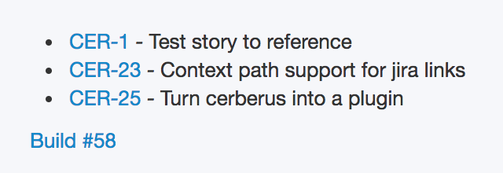
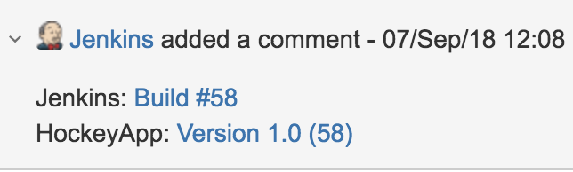

# How to improve traceability in your build pipeline

## Is this for me?

**Do you manually update release notes of your app?**

Wish your changelog was automatically generated for you, like so?

**Do you manually comment about automated events on your tickets?**

Wish your ticket automatically received a comment about build and deploy events, like so?

Read on, you may find this tool useful.

## Motivation

We use [Bitbucket], [Jenkins], [Jira], [HockeyApp], and [TestFlight]. Using these disparate tools came at a cost.

The tools operated in silos and exchanged very little information with each other. This made handover of a story from developer to QA to product owner that much harder. Precious project time was being spent on chasing other people and waiting for builds to complete.

We took a look at our toolchain and identified areas where information was being lost in transit.

A commit contained the story card it correlates to, but our CI server did not receive that information from source control.
CI at this point in time has no idea what it is building and hence could not pass any information on to the HockeyApp changelog.

Since the system was unable correlate a deployment to a ticket, the feedback loop was broken. Jira was not notified of successful deployments of tickets, leaving humans to wait for builds to finish before they could manually annotate a card with the release number.

We created Cerberus to bring back the information that was lost along the way. It works behind the scenes to extract and forward information to tools further down the chain which then report back to Jira, thus completing the feedback loop.

## How does it do it?

Cerberus is a collection of the following tasks that work together to achieve a common goal:

1. Ticket numbers are harvested from commit messages
1. The Jira API then provides additional information about the tickets
1. The information is collated into a changelog and passed along to tools such as HockeyApp and Testflight
1. Jira tickets receive a comment with the link to the deployed artifact(s)

## Where to go from here?

Cerberus is compatible with any project that uses [fastlane] or [gradle] and [Jira] as the project tracker. If you would like to give it a spin:

! Add pending links and instructions here!

## Conclusion

Cerberus helped us by 'wiring up' tools that wouldn't normally speak to each other. Jira now serves as a source of truth and as a dashboard of information. Our team members don't have to chase up on our tools or chase up each other, giving them time to think about and solve harder problems.

---

Do you see an issue with our plugins or want to add a new feature? Feel free to submit a PR to Github <!link pending>

<!-- Links -->
[fastlane]: https://fastlane.tools/
[Gradle]: https://gradle.org/
[Jira]: https://www.atlassian.com/software/jira
[Bitbucket]: https://bitbucket.org
[Jenkins]: https://jenkins.io/
[HockeyApp]: https://hockeyapp.net
[TestFlight]: https://developer.apple.com/testflight/
