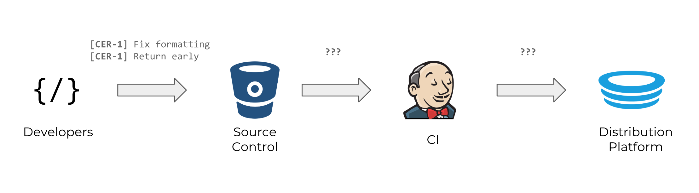
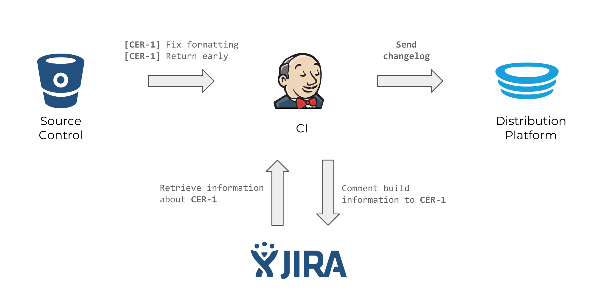

# How to improve traceability in your build pipeline

## Is this for me?

**Do you manually update release notes of your app?**

Wish your changelog was automatically generated for you, like so?

><ul>&#x000A;<li><a href="https://tools.outware.com.au/browse/CER-1">CER-1</a> - Test story to reference</li>&#x000A;<li><a href="https://tools.outware.com.au/browse/CER-23">CER-23</a> - Context path support for jira links</li>&#x000A;<li><a href="https://tools.outware.com.au/browse/CER-25">CER-25</a> - Turn cerberus into a plugin</li>&#x000A;</ul>&#x000A;&#x000A;
<a href="https://ci.omdev.io/job/Outware%20Team%20Branch%20Builder/job/omproject-ios-swift-cerberus/job/develop/58/">Build #58</a>

**Do you manually comment about automated events on your tickets?**

Wish your ticket automatically receive a comment about build and deploy events, like so?

> CI Bot added a comment - 07/Sep/18 12:08 PM 
>
Jenkins: <a href="https://jenkins.io/" class="external-link" rel="nofollow">Build #58</a> 
HockeyApp: <a href="https://hockeyapp.net" class="external-link" rel="nofollow">Version 1.0 (58)</a>

read on, you may find this tool useful.

## Motivation

We use Bitbucket, Jenkins, Jira, Hockey and Testflight. Using these disparate tools came at a cost. The tools operated in silos and exchanged very little information with each other. This made handover of a story from developer to QA to product owner that much harder. Precious project time was being spent on chasing other people and waiting for builds to complete.

We took a look at our toolchain and identified areas where information was being lost in transit.

A commit contained the story card it correlates to, but CI did not receive that information from SCM.
CI at this point in time, has no idea what it is building and hence cannot pass this information on to Hockey or Testflight.

Since a deployment cannot be correlated to a ticket, the feedback loop is broken. Jira is not notified of successful deployments of tickets, leaving humans to wait for builds to finish before they can annotate a card with the release number.

We created Cerberus to bring back the information that was lost along the way. It works behind the scenes to extract and forward information to tools further down the chain which then report back to JIRA, thus completing the feedback loop.

## How does it do it?

Cerberus is a collection of the following tasks that work together to achieve a common goal:

1. Ticket numbers are harvested from commit messages
2. The JIRA API then provides additional information about the tickets
3. The information is collated into a changelog and passed along to tools such as Hockey and Testflight
4. JIRA tickets receives a comment with the link to the deployed artefact(s)

## Where to go from here?

Cerberus is compatible with project that use Fastlane or Gradle. If you would like to give it a spin:

! Add pending links and instructions here !

## Conclusion

Cerberus helped us by 'wiring up' tools that wouldn't normally speak to each other. JIRA now serves as a source of truth and as a dashboard of information. Our team members don't have to chase up on our tools or chase up each other,  giving them time to think about and solve harder problems.

---

Do you see an issue with our plugins or want to add a feature? Feel free to submit a PR to Github <!link pending>
